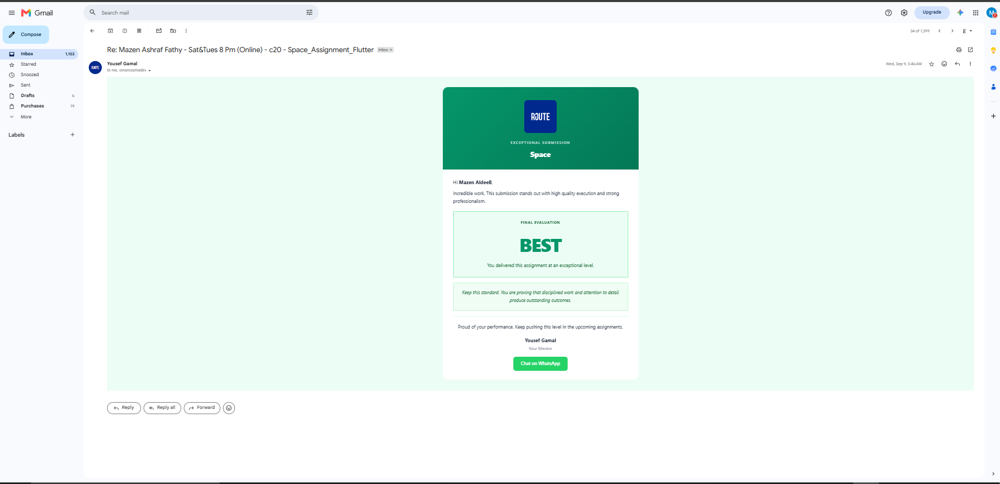
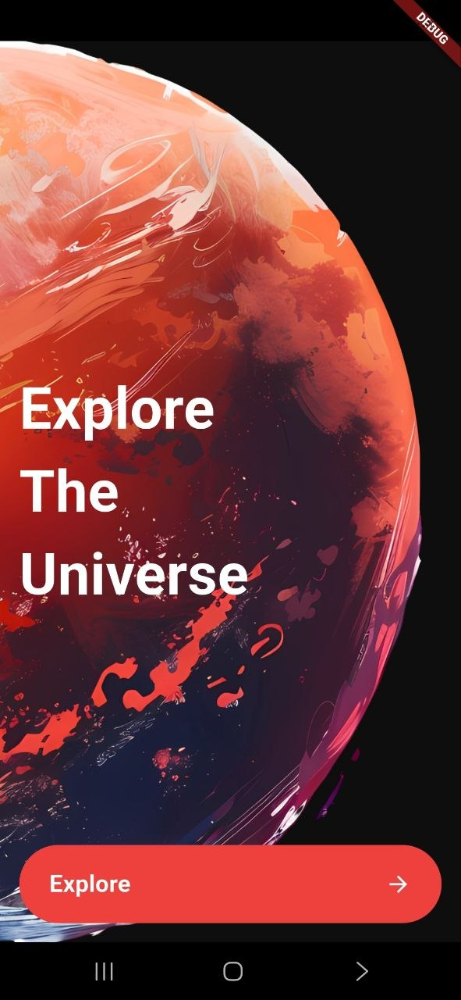
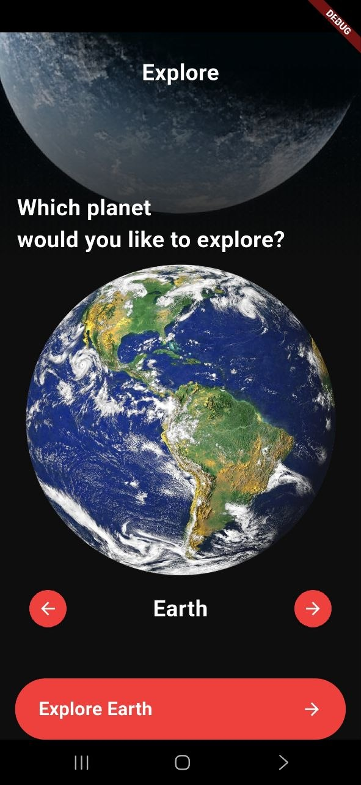
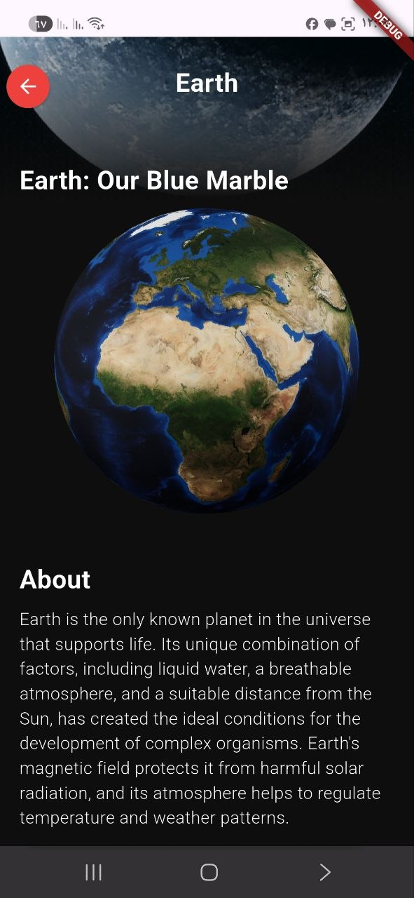
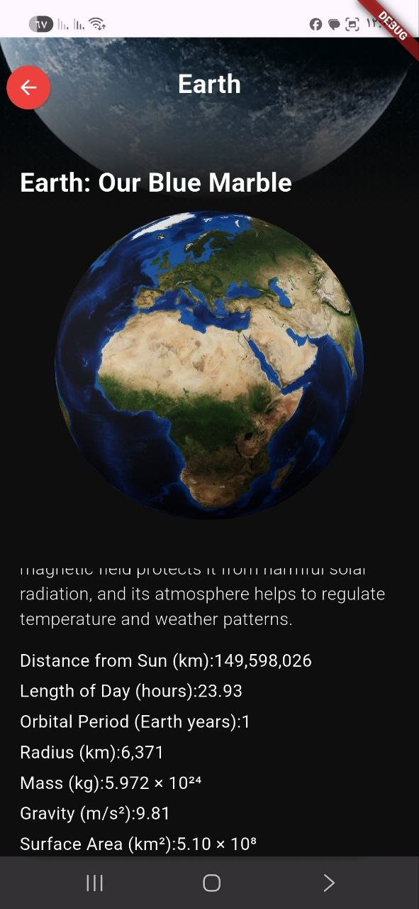

# 🌌 Space Exploration Mobile App

An interactive, visually rich cross-platform space exploration application built using **Flutter & Dart**. The app allows users to seamlessly navigate through the solar system, view detailed physical characteristics of planets, and interact with real-time 3D planetary models.

Developed as part of the **Route Mobile Diploma** curriculum.

---

## 🏆 Course Evaluation & Mentor Feedback

<p align="center">
  
</p>

> **Mentor Feedback (Yousef Gamal - Route Academy):**  
> *"Incredible work. This submission stands out with high quality execution and strong professionalism. Keep this standard. You are proving that disciplined work and attention to detail produce outstanding outcomes."*[cite: 1]

---

## 📸 Screenshots & UI Flow

| Splash Screen | Exploration View | 3D + About | Planet Details Specs |
| :---: | :---: | :---: | :---: |
|  |  |  |  |

---

## 🎨 Design System & Specifications

The UI is built strictly according to Figma layout specifications:
- **Primary Background**: Space Dark (`#0E0E0E`)
- **Accent Color**: Dynamic Red (`#EE403D`)
- **Text Color**: Clean White (`#FFFFFF`)
- **Layout Architecture**: Stacked Layers with overlaid linear gradients for clean image blending.

---

## ⚡ Technical Highlights & Performance Optimization

### 1. Efficient State Management (`ValueNotifier`)
- Integrated `ValueNotifier<int>` paired with `ValueListenableBuilder` to synchronize page indices across gestures (`PageView` swipes) and programmatic navigation (`Arrow Buttons`).
- **Performance Gain**: Prevents unnecessary re-builds of heavy screen components (like static backgrounds and AppBars) by updating only the changing text labels and action buttons.

### 2. 3D Model Rendering
- Implemented `flutter_3d_controller` to render dynamic 3D `.glb`/`.usdz` planet models on the details screen.
- Managed arguments passing between route transitions for responsive parameter updates.

### 3. Custom UI Layering
- Engineered stacked AppBars using gradient overlays over background imagery to achieve seamless aesthetic boundaries.

---

## 🛠️ Tech Stack & Dependencies

- **Language**: Dart
- **Framework**: Flutter
- **3D Handling**: [`flutter_3d_controller`](https://pub.dev/packages/flutter_3d_controller)
- **UI Paradigm**: Material Design / Custom Stacked Layouts

---

## 🚀 How to Run

1. **Clone the repository:**
   ```bash
   git clone [https://github.com/Mazen-Ashraf-Aldeeb/space_app.git](https://github.com/Mazen-Ashraf-Aldeeb/space_app.git)